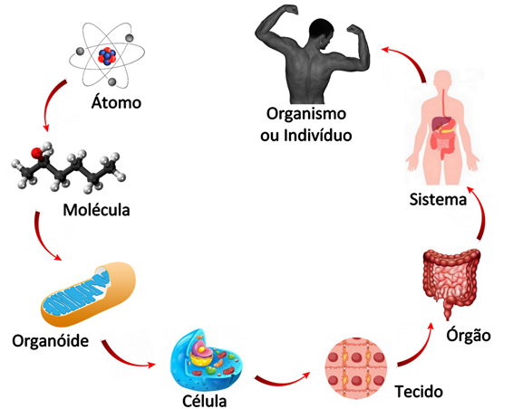

# BioLayout
## Repositorio sobre a metodologia BioLayout

O Biolayout é o casamento entre duas metodologias Atomic Design e Biocomponents. Para elaborar a ideia do Biolayout foi usada como base de análise a imagem abaixo que explica bem o ciclo de vida do ser humano.

## Ciclo de vida do Biolayout
   Começamos com as ideias bases da metodologia Atomic Design com átomos e moléculas.
### Átomos:
   Os átomos são partes minúsculas e essenciais para executarmos nosso layout, podemos levar como exemplo nossas tags HTML.
### Moléculas:
 Para formar nossas moléculas pegamos um grupo de átomos e os unimos, assim obtemos um resultado que no caso podemos ter como um exemplo a parte de um menu.
